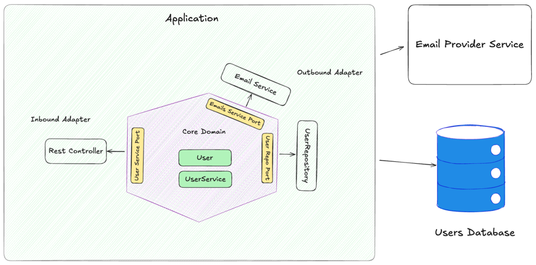

# Hexagonal Architecture Spring Boot Demo

This project demonstrates a clean implementation of Hexagonal Architecture (Ports and Adapters) using Spring Boot and Kotlin.

## Hexagonal Architecture

Hexagonal Architecture, also known as the Ports and Adapters architecture,
is a software design pattern that aims to create loosely coupled application
components so that the core logic is isolated from external concerns like
databases, UI, or third-party services.

### Core Concepts

The key idea is to encapsulate the application's core logic and expose it through ports,
which can be connected to any adapter (like a web interface, CLI, database, or message queue).

This makes the application:

* More testable (core logic can be tested without involving external systems)

* Easier to maintain and extend

* More adaptable to changes in technologies

### Structure

1. Core (Application Domain): Contains the business logic.

   Defines interfaces (ports) for how it communicates with the outside world. 
   Is completely unaware of any frameworks or infrastructure.

2. Ports: Interfaces that define how the application expects to interact with the outside world. 
   
   Inbound ports: Entry points for driving the application (e.g., use cases, UserService). 

   Outbound ports: Interfaces the core uses to call out to other systems (e.g., repository interfaces, EmailsService).

3. Adapters: Implement the ports.

   Inbound adapters: UI controllers, REST APIs, CLI, etc.

   Outbound adapters: Database implementations, external API clients, message brokers.

## Architecture Overview

Top level diagram



The project follows the hexagonal architecture pattern with clear separation of concerns:

### Domain Layer (Core)
- **Models**: `User`, `UserEmail` - Pure domain objects with business logic
- **Ports**: Interfaces defining contracts (`UserRepository`, `EmailService`, `UserService`)
- **Services**: `UserDomainService` - Contains business logic and orchestrates domain operations

### Infrastructure Layer (Adapters)
- **Persistence**: JPA entities and repository adapters
- **Messaging**: Email service adapter (simulated)

### Application Layer (Adapters)
- **Web**: REST controllers and supporting Models
- **Configuration**: Web-specific configuration

## Key Features

- **Clean Architecture**: Clear separation between domain, infrastructure, and application layers
- **Test-Driven Development**: Comprehensive unit and integration tests using Kotest
- **Dependency Inversion**: Domain depends only on abstractions, not concrete implementations
- **Business Logic Protection**: Core business rules are isolated from external concerns
- **Validation**: Both domain-level and presentation-level validation

## Project Structure

```
src/
├── main/kotlin/com/example/hexagonal/
│   ├── domain/           # Core business logic
│   ├── infrastructure/   # External adapters
│   └── application/      # Application layer and Extneral adapters
├── test/kotlin/          # Unit tests
└── integrationTest/kotlin/  # Integration tests
```

## Testing Strategy

- **Unit Tests**: Test domain logic in isolation using mocks
- **Integration Tests**: Test adapter implementations with real dependencies
- **Separate Gradle Tasks**:
    - `./gradlew integrationTest` - Runs integration tests
    - `./gradlew test` - Runs all tests

## Running the Application

```bash
# Run unit tests
./gradlew test

# Run only integration tests
./gradlew integrationTest

# Run the application
./gradlew bootRun
```

## API Endpoints

- `POST /api/users` - Create a new user
- `GET /api/users` - Get all users
- `GET /api/users/{id}` - Get user by ID
- `GET /api/users/by-email?email={email}` - Get user by email
- `DELETE /api/users/{id}` - Delete user
- `POST /api/users/promotional-emails?content={content}` - Send promotional emails to eligible users

## Business Rules

- Users must have valid email addresses
- User age must be between 0 and 150
- Only adult users (18+) can receive promotional emails
- Email addresses must be unique
- Welcome emails are sent automatically upon user creation

## Technology Stack

- **Kotlin** - Primary language
- **Spring Boot 3.2** - Application framework
- **Spring Data JPA** - Data persistence
- **H2 Database** - In-memory database for testing
- **Kotest** - Testing framework
- **MockK** - Mocking library
- **Gradle** - Build tool